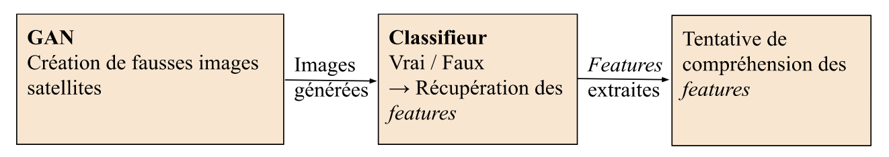

# __Discrimination par un classifieur YOLO d'images satellites générées par un cGAN pix2pix__

GitHub contenant les données, notebooks et le rapport associés au projet 1 : GAN image, réalisé dans le cadre du cours Python (enseignant [Chahan Vidal-Gorène ](http://cv.hal.science/chahan-vidal-gorene)) du [Master Humanités Numériques de l'ENC ](https://www.chartes.psl.eu/fr/rubrique-admissions/master-humanites-numeriques).

# __Pipeline du projet__

Chaîne de traitement (ou _pipeline_) implémentée au cours du projet.

# __Résumé__

# Contenu du dépôt
- `notebooks/` : 
  - `GAN/`:
    - `/` : 
  - `yolo/` : 
    - `runs/`: dossier contenant les résultats des entraînements YOLO
- `rapport` : Rendu contenant les explications sur la méthode utilisée et les résultats.

# Auteurs
Ce projet a été réalisé par :

- Lise Bernard
- Charlotte Berthier
- Axelle Salvador
- Albina Toumarkine
